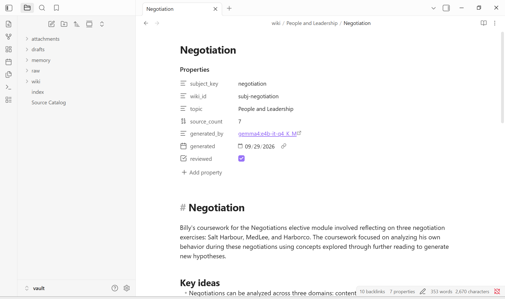
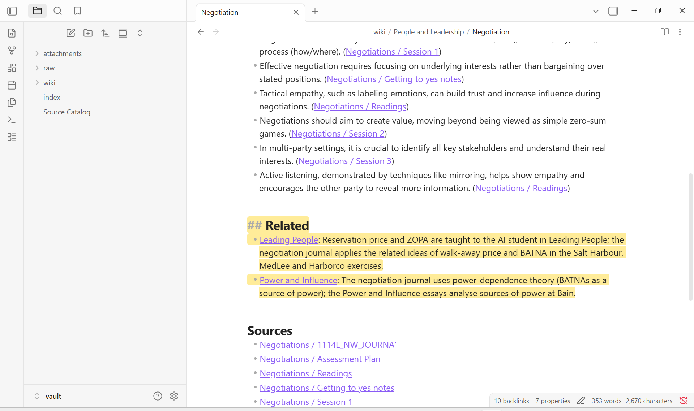
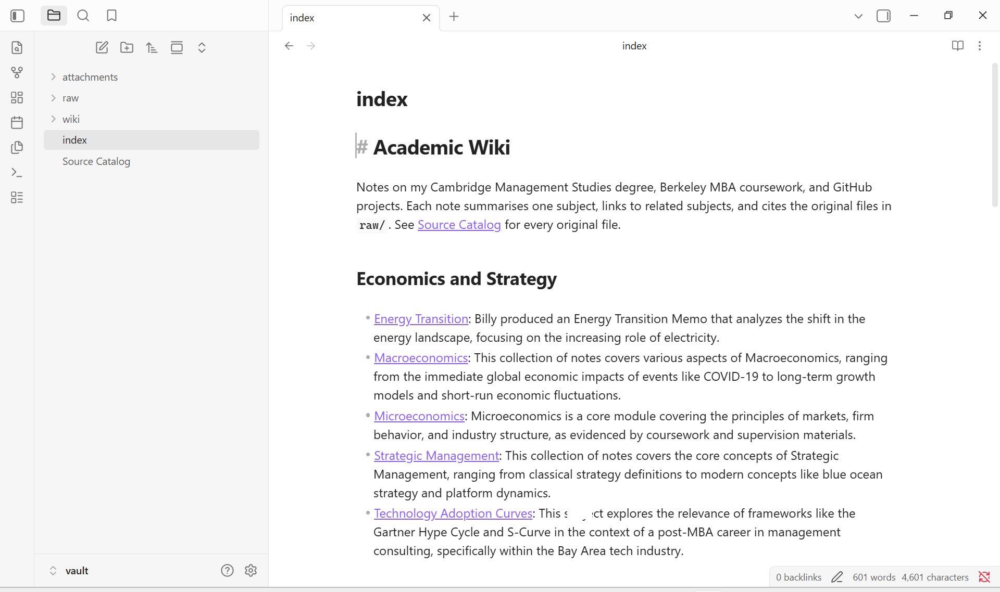
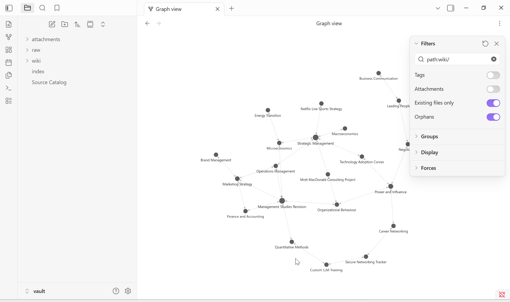
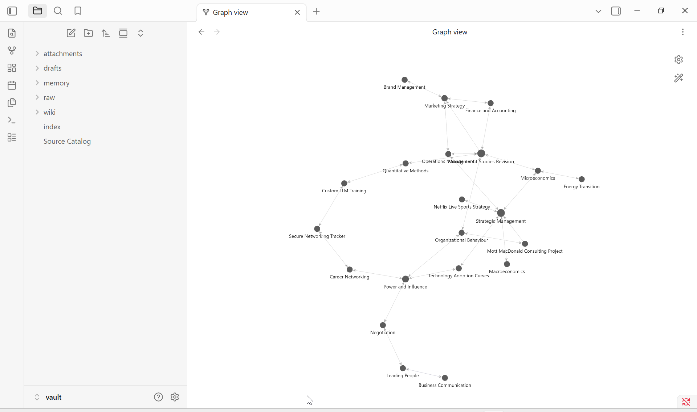

# Academic Wiki CLI: local Gemma + RAG (Class 5, Assignment 4)

This is my own command-line tool and harness for talking to my own academic notes. It uses an open-weight Gemma
model that runs on my laptop and works with the internet disconnected.

- **Watch:** [recorded offline run (11 min video)](evidence/offline-recorded/offline-demo.mp4)
- **Results:** [offline test summary](evidence/offline-recorded/summary.md). All 4 ask tests and 5 mode checks pass.
- **Wiki:** open [`vault/`](vault) in Obsidian, starting at [`vault/index.md`](vault/index.md). It has 21 subject notes in 6 topic folders.
- **Obsidian:** [screenshots](#obsidian-screenshots) of an open note, the index and the graph.
- **Model choice:** [E2B vs E4B comparison](evidence/model-comparison.md). Both pass every test; E2B is faster, E4B cites more carefully.
- **Optional online mode:** hosted `gemma-4-26b-a4b-it` passes the same four ask tests ([evidence/online](evidence/online/summary.md)). Local is the default.
- **Not done:** see [What is incomplete](#what-is-incomplete).

## 1. Purpose and sources

The wiki lets me find and question my coursework and projects across two degrees and my GitHub.

| Source | Files | What |
|---|---|---|
| Cambridge Management Studies, Year 3 | 158 | lecture notes, supervision work, essays, the Mott MacDonald project |
| Berkeley MBA academics | 23 | essays, memos, homework (spreadsheets and media excluded) |
| My GitHub repos (`Assignment-1`, `class4-custom-llm`) | 13 | README, assignment and log Markdown |
| Added during the two offline demos | 2 | Energy Transition memo, Netflix live-sports project idea |

**How the originals connect to the pages:**
- Originals are copied byte-for-byte into `vault/raw/` and sha256-verified by
  [scripts/collect_sources.py](scripts/collect_sources.py). They are never edited.
- [subjects.yaml](subjects.yaml) maps the raw files to subject notes in `vault/wiki/<Topic>/`.
- Each note lists its originals under `## Sources`, and each key idea links to the file it came from.
- [vault/Source Catalog.md](vault/Source%20Catalog.md) lists every original with its origin, fingerprint, passage count and note.

**Trace one note:** [Negotiation](vault/wiki/People%20and%20Leadership/Negotiation.md) → related note
[Power and Influence](vault/wiki/People%20and%20Leadership/Power%20and%20Influence.md) ("BATNAs as a source of power") →
its source `raw/mba/Power and Pol essay.docx`.

**Not in the repo:** 12 originals are kept on my machine ([withheld.yaml](withheld.yaml)): third-party material I cannot
republish (a textbook, an industry report, other people's summaries) and notes containing other people's words from
interviews and focus groups.
- Notes and the catalog link to a stub page for each one in [`vault/withheld/`](vault/withheld), marked "kept local". The stub
  says what the file is, why it is not here, its sha256 and which note uses it.
- So every source link in a clone of this repo resolves. I checked this on a fresh clone
  ([evidence/clone-link-check.md](evidence/clone-link-check.md)).
- Locally the files are still indexed. Answers on my machine can cite passages from them that a clone cannot open.

## 2. Setup and device

| | |
|---|---|
| OS | Windows 11 Pro 10.0.26200 |
| CPU | AMD Ryzen 5 7533HS (6 cores / 12 threads) |
| RAM | 13.3 GB usable (16 GB installed, part reserved for the integrated GPU); 1.2–5.8 GB free before runs |
| GPU | AMD Radeon 660M integrated, shared memory, no dedicated VRAM. Ollama ran 100% on CPU. |
| Free disk | 348 GB |
| Runtime | Ollama 0.34.4 for the first offline run. Ollama updated itself to **0.35.0** mid-project, so the recorded run uses 0.35.0. |
| Chat model | `gemma4:e4b-it-q4_K_M`: Gemma 4 E4B, 7.5B total parameters, Q4_K_M, 6.6 GB download |
| Embedding model | `embeddinggemma` (307M parameters, 621 MB), also local |
| Settings | `num_ctx` 8192, thinking off, temperature 0.1 (ask) / 0.7 (chat) |

Official sources: <https://ai.google.dev/gemma/docs/core> and <https://ollama.com/library/gemma4>. The weights are not in this
repo.

```powershell
winget install Ollama.Ollama
ollama pull gemma4:e4b-it-q4_K_M
ollama pull embeddinggemma
py -3.13 -m venv .venv
.\.venv\Scripts\python -m pip install -e .
# optional, for OCR of scanned PDFs: winget install UB-Mannheim.TesseractOCR ; pip install pypdfium2 pytesseract
```

```powershell
wiki --help
wiki doctor
wiki ingest                       # or: wiki ingest path\to\new-source.docx
wiki search "lean operations waste" -k 5
wiki ask "Who was the client for my Cambridge consulting project?" --mode local
wiki chat                         # /notes QUERY, /remember TEXT, /draft, /save, /reset, /exit
wiki lint
wiki rename "Old Name" "New Name"
wiki serve                        # optional local web page at http://127.0.0.1:8765
```

### Optional online mode (separate from the offline instructions above)

- **Select it:** set `GEMINI_API_KEY` (from Google AI Studio), then run `wiki ask "…" --mode online`.
- **Endpoint:** hosted `gemma-4-26b-a4b-it` on the Gemini API (`generativelanguage.googleapis.com`). This is the 26B A4B
  model that does not fit on this laptop.
- **Data sent to Google:** the research instructions, the question, and up to 4 retrieved passages (at most 4,000 characters
  of my notes). Retrieval and embeddings stay local.
- **Never a fallback:** it runs only when `--mode online` is given. If the API fails, the command stops with the error.
- **Evidence:** the four ask tests pass ([evidence/online](evidence/online/summary.md), details in
  [web-ui-and-online-mode.md](evidence/optional/web-ui-and-online-mode.md)). Online chat also works, with retrieval through `/notes`.

### Why this model

- The 26B A4B MoE model is 18 GB at Q4_K_M in Ollama. It activates about 4B parameters per token, but all 26B must be
  loaded, so it cannot fit in 13.3 GB.
- E2B (4.6 GB) and E4B (6.6 GB) both fit.
- I chose E4B because I expected it to follow citation and refusal rules more reliably. It passed all four tests in both offline runs.
- I then ran the same tests and benchmark on E2B ([model-comparison.md](evidence/model-comparison.md)):
  - E2B also passes all nine checks.
  - It answers in about 20 s where E4B takes about 35 s, and writes a note in 43 s where E4B takes 78 s.
  - It leaves about 1 GB more RAM free. E4B's cold load drove free memory down to 0.2 GB.
  - It made one unsupported citation in four answers (T3). E4B made none.
- **So E2B is the smallest model that works here.** The repo default stays E4B because every offline run, the recording and
  the 21 notes were produced with it and its citations were exact. Switching is one setting: `WIKI_MODEL=gemma4:e2b-it-q4_K_M`.
- The comparison is one run per model on four questions. E2B was not run offline or used to write notes.

### Measured memory and response time (E4B, this laptop, my wiki)

| Measurement | Value | Where |
|---|---|---|
| Model load, cold | 18.2–28.2 s | [bench](evidence/bench/bench-gemma4_e4b-it-q4_K_M.md), first smoke test |
| RAG answer, cold (load included) | 63.9 s; first token at 56.8 s | bench |
| RAG answer, uncached prompt (T2, T3, T4; both offline runs) | 35.3–37.9 s; first token at 32–36 s; ~950–1,040 prompt tokens at ~31 tok/s; 9.6–13.8 tok/s generation | [offline](evidence/offline/ask), [offline-recorded](evidence/offline-recorded/ask) |
| RAG answer, repeated question (prompt cached) | 7.8–9.8 s | T1 cards, bench |
| Chat turn without retrieval | 11.4–30.1 s | mode_checks.json |
| Keyword search / hybrid search | 0.01 s / 2.1 s | bench |
| Ingest one new source offline (copy, parse, embed, Gemma writes the note, rebuild index) | 108.4 s (run 1); the note alone 92.5–98.3 s | transcript, video |
| Re-ingest with nothing changed | 1.5 s, 0 notes written | [03-reingest-and-rename.log](evidence/ingest/03-reingest-and-rename.log) |
| First full ingest: embedding 5,087 passages | 2,184 s (2.3 passages/s) | one-off; cached afterwards |
| First full ingest: Gemma writing a note | 60–100 s each (872 s for the last 9) | [ingest logs](evidence/ingest) |

**Memory** (E4B; [bench](evidence/bench/bench-gemma4_e4b-it-q4_K_M.md), sampled every 0.25 s across all Ollama processes):
- Peak resident memory was **7.62 GB during a cold load**, settling to about 5.4 GB once warm.
- Free system RAM fell to **0.2 GB** during the cold load and stayed at 1.5–1.9 GB afterwards.
- At the end of the recorded offline run, the process holding the chat model (`llama-server.exe`) had 3,861 MB resident and
  8,590 MB committed ([transcript](evidence/offline-recorded/transcript.txt) section 9).
- `ollama ps` reports 1.76–1.9 GB for the chat model, which understates what the process holds.
- An earlier version of the benchmark reported 0.02 GB because its sampler watched `ollama.exe` and not `llama-server.exe`.
  That was fixed and the benchmark rerun; the figures above are from the rerun.
- E2B for comparison: 5.32 GB peak, never below 2.68 GB free ([model-comparison.md](evidence/model-comparison.md)).

## 3. Architecture

- **Model:** local Gemma. It only sees the text the harness puts in a prompt.
- **Retrieval tool** ([wiki/retrieval.py](wiki/retrieval.py)): `Retriever.search()` ranks original passages and returns them
  with raw path, locator and owning note. It never generates text.
- **RAG workflow** (`Harness.ask` in [wiki/harness.py](wiki/harness.py)): retrieve → number the evidence → prompt with the
  research rules → Gemma → check citations.
- **Harness** ([wiki/harness.py](wiki/harness.py)):
  - chooses the behaviour per mode
  - loads the right instruction file
  - keeps chat history
  - decides whether retrieval happens
  - calls the model through [wiki/llm.py](wiki/llm.py)
  - validates citations
  - turns failures into clear errors (Ollama down, model missing, empty index)
  - saves every run under `.wiki/runs/`.
- **CLI** ([wiki/cli.py](wiki/cli.py)): argument parsing and printing only.
- **Ingest** ([wiki/pipeline.py](wiki/pipeline.py), [wiki/ingest/](wiki/ingest/__init__.py), [wiki/notes.py](wiki/notes.py)):
  parse → passages → embeddings → Gemma-written subject notes → index and catalog.

**One path, from command to result:** `wiki ask "What price gap …?"`
1. `cli.main` parses the arguments and builds `Harness(OllamaClient())`.
2. `Harness.ask` calls `Retriever.search(question, k=4)`:
   - BM25 scores over 5,119 passages
   - an `embeddinggemma` query vector and cosine scores
   - reciprocal rank fusion, then near-duplicate removal.
3. If the best cosine is below 0.45, it returns insufficient evidence without calling Gemma.
4. `format_evidence` numbers the passages `[1]..[4]` with source labels, up to 4,000 characters.
5. A fresh two-message prompt is built: `prompts/wiki-instructions.md` plus the question and evidence. It contains no chat
   history and no persona.
6. `OllamaClient.chat` streams from `localhost:11434`.
7. The reply is checked:
   - `INSUFFICIENT_EVIDENCE` → refusal.
   - No valid `[n]` → rejected as ungrounded.
   - Invalid numbers are stripped.
8. The answer and the cited raw paths are printed, and the run is saved as JSON and Markdown.

**Chat** uses `prompts/persona.md` (Quill) and a rolling history of 8,000 characters.
- Gemma gets a `search_notes` tool through Ollama's native function calling and decides whether to call it.
- If it does, the harness runs the retrieval tool, returns numbered passages, and checks the citations in the reply.
- `/notes QUERY` forces a lookup.

**Search** prints the retrieval tool's output. It runs keyword-only if Ollama is not running.

## 4. Design choices

Written before testing: [docs/choices-and-expectations.md](docs/choices-and-expectations.md).

- **Passages:** about 900 characters with 150 characters of overlap, cut on document structure. Locators are the section heading, page or slide.
- **How much text Gemma sees:**
  - Ask: at most 4 passages / 4,000 characters (about 1,000 prompt tokens).
  - Note writing: opening excerpts of up to 12 files, about 6,000 characters (800–1,900 prompt tokens).
- **Retrieval:** hybrid BM25 plus local embeddings with equal-weight fusion. I tested heavier embedding weights and
  rejected them ([fusion_weights.md](evidence/retrieval/fusion_weights.md)).
- **Instructions are separate files:**
  - [persona.md](prompts/persona.md) for chat only
  - [wiki-instructions.md](prompts/wiki-instructions.md) for ask only
  - [note-writer.md](prompts/note-writer.md) for ingest only.
- **Notes:**
  - One note per subject, not per file. For example, Microeconomics draws on Cambridge MS3 and MBA economics work.
  - Titles are 2–6 words and fixed in `subjects.yaml`. Gemma writes the body, not the name.
  - Machine IDs (`subject_key`, `wiki_id`) live in note properties.
  - Chunks, embeddings and the manifest live in `.wiki/`, outside the vault.
  - `wiki lint` rejects hash-, date-, export- and sentence-style names, broken links and notes with no incoming links.
- **Re-ingestion:**
  - A note is found by its `subject_key` property, not its filename.
  - It is regenerated only if the sha256 set of its sources changed.
  - It is rewritten in place and keeps its `## My Notes` section.
  - Evidence: [03-reingest-and-rename.log](evidence/ingest/03-reingest-and-rename.log) shows 0 notes written and 21 unchanged. A
    rename then updated 4 files' links, lint stayed clean, no duplicate appeared, and the old name was not restored.
- **Review:**
  - Every generated note was checked against its originals.
  - Four claims were corrected (one unsupported detail, one wrong attribution, two imprecise statements) and two missing source links were added.
  - The "related" links were rewritten by hand, because Gemma's reasons were often generic.
  - Log: [note_review.md](evidence/review/note_review.md). Method: [term_coverage.md](evidence/review/term_coverage.md).
- **Thinking mode is off.** Gemma 4 turns it on by default, and it multiplies CPU latency.
- **PDFs and OCR:** text PDFs are parsed with pypdf. Scanned PDFs go through local Tesseract with a confidence gate
  ([ocr_check.md](evidence/ocr/ocr_check.md)). One typed scan was recovered; nine handwritten ones were rejected.

## 5. Evidence

Both offline runs had Wi-Fi and Ethernet disconnected, and Ollama and the CLI restarted first. Model: `gemma4:e4b-it-q4_K_M`, local.

| Run | What | Proof |
|---|---|---|
| **Recorded run** (Ollama 0.35.0, 21-note wiki) | help, doctor, ingest of a new source, the same source ingested again, search, ask, chat with a follow-up, all tests, then a scroll through the results | [video](evidence/offline-recorded/offline-demo.mp4), [summary](evidence/offline-recorded/summary.md), [transcript](evidence/offline-recorded/transcript.txt) |
| First run (Ollama 0.34.4, 11-note wiki) | same tests | [summary](evidence/offline/summary.md), [transcript](evidence/offline/transcript.txt) |

Proof of being offline in each transcript: adapter status "Disconnected", a failed TCP test to 8.8.8.8, and a failed DNS lookup.
The recorded transcript captures the PowerShell sections but not the CLI's own output; that output is visible in the video.

| Test (recorded run) | Result | Card |
|---|---|---|
| T1 direct, one source | answered, cited the expected source | [T1](evidence/offline-recorded/ask/T1.md) |
| T2 paraphrased | answered, cited the expected source (retrieved at rank 4 of 4) | [T2](evidence/offline-recorded/ask/T2.md) |
| T3 two sources | answered, cited two Mott project files | [T3](evidence/offline-recorded/ask/T3.md) |
| T4 unsupported | `INSUFFICIENT_EVIDENCE` from the model | [T4](evidence/offline-recorded/ask/T4.md) |
| Chat "what can you help me with?" / "what can we do?" | capabilities, no notes search, no citations | [mode_checks.md](evidence/offline-recorded/mode_checks.md) |
| Chat draft → "make that shorter" | 793 → 375 characters from conversation context | same |
| Search "lean operations waste" | 5 original passages, 0 model calls | same |
| Separation: mark claimed in chat, then asked in ask | ask still returned insufficient evidence | same |

Each card has the question, expected source, retrieved passages and paths, the answer, the citations, automated checks and my
assessment after opening the cited passage.

Other evidence:
- **Retrieval alone:** [retrieval_check.md](evidence/retrieval/retrieval_check.md) compares keyword-only and hybrid. Keyword-only
  missed T2 completely; hybrid found it.
- **Test questions:** [tests/questions.yaml](tests/questions.yaml). They were written before retrieval was built and are kept
  outside the vault.
- **Model comparison:** [model-comparison.md](evidence/model-comparison.md), with the E2B run in [evidence/e2b](evidence/e2b/summary.md).
- **Optional extras:**
  - [memory and drafts](evidence/optional/memory-and-drafts.md) (`/remember`, `/draft`): tested; two bugs found and fixed.
  - [local web page and online mode](evidence/optional/web-ui-and-online-mode.md): the web page is tested; online mode
    passes the four ask tests ([evidence/online](evidence/online/summary.md)), labelled separately from the local runs.

### Obsidian screenshots

`vault/` opened as the vault in Obsidian 1.13.7. Captured by [scripts/obsidian_screenshots.ps1](scripts/obsidian_screenshots.ps1).

**1. An open note.** Short filename, matching heading, machine IDs in properties, `reviewed` ticked.



The same note opened at its Related heading (Obsidian highlights the section the link targets). It shows key ideas each
linked to the file they came from, the related notes with a reason for each link, and the source references. Each source
link opens the original file in `raw/`.



**2. The index**, grouped by topic with a one-line description per note.



**3. The graph view.** Filter used: `path:wiki/`, Attachments off, existing files only.



The same graph with the filter panel collapsed, so all 21 note labels are visible.



Not shown in a screenshot: a click-through from a note to a source file. It can be checked by opening the vault.

## 6. Reflection: failures and limitations

1. **Keyword retrieval failed the paraphrased question (T2).**
   - BM25 alone did not return the source in the top 5; adding embeddings brought it to rank 4.
   - It is still last among the passages shown, because keyword matches on "gap" and "price" outrank it under equal-weight fusion.
   - Reweighting hurt T3.
   - Improvement to try: rerank the top 20 by cosine only, or add a small local reranker.
2. **Chat sometimes asks instead of searching.** In the recorded CLI chat, I asked for a plan based on my Negotiation notes.
   Gemma replied "Would you like me to use the search_notes tool?" and did not call it. The `/notes` command forces the lookup.
   Improvement: a firmer tool instruction in `persona.md`, or a harness rule that retrieves when the message names a wiki subject.
3. **T3 is correct but thin.** It cites the meeting notes for "focus groups" rather than the PID I expected, and adds "could
   also use surveys" with no detail.
4. **Handwritten scans are unreadable.** Tesseract scored 40–46 confidence on nine handwritten supervisions, so they are
   excluded from the index. A handwriting model such as TrOCR is the next step.
5. **Speed.** About 35 s per uncached answer on CPU. Ollama's log says the AMD driver is too old for GPU inference and that it
   dropped the integrated GPU (`OLLAMA_IGPU_ENABLE=1` would enable it). I did not test that. E2B is about 1.7x faster
   ([model-comparison.md](evidence/model-comparison.md)).
6. **Notes are written from samples.** Gemma sees only the opening excerpts of up to 12 files per subject, so large subjects
   (Finance has 14 files, Operations 26) are summarised from a sample. The review caught one unsupported detail, one wrong attribution and two
   imprecise claims, which suggests a smaller model needs this check every time.
7. **Gemma claimed to have saved something it had not.** While testing `/remember`, a command the CLI failed to recognise
   reached Gemma, which replied "Okay, I've logged that". Nothing had been saved. Unknown `/commands` are now rejected by the
   harness and never reach the model ([details](evidence/optional/memory-and-drafts.md)). The same test showed Gemma adding
   "[1]" to a remembered fact with no source behind it; the harness now strips citation markers when nothing was retrieved.
8. **Citation checks are shallow.** The harness confirms a cited number exists, not that the passage supports the claim.
   E2B's T3 answer cited a passage that does not name the client and still passed. Improvement: check that the key terms of
   each cited sentence appear in the cited passage.
9. **A runtime auto-update broke a run.** Ollama updated itself mid-ingest and killed the server. The harness reported
   "Ollama is not reachable" and the ingest resumed cleanly afterwards, but the results now span two runtime versions.

## What is incomplete

- **Online chat cannot search by itself.** Online ask (4 / 4 pass) and online chat both work, but hosted Gemma is not given the
  `search_notes` tool, so online chat retrieves only when I type `/notes`. The API also returned sporadic HTTP 500 errors,
  which the client retries.
- **E2B is not the default, and was only tested online.** The comparison shows it is the smallest model that works, but it
  was run once, with the internet connected, and never used to write notes.
- **The web page's Ask and Chat tabs were not clicked through by hand.** Their endpoints were tested, and the Search tab was
  tested in a browser.
- **No click-through from a note to a source file is shown.** The screenshots show the links; following one was not recorded.
- **Nine handwritten scans are not searchable** (see limitation 4).
- **The recorded transcript lacks the CLI's own output.** The video shows it.
