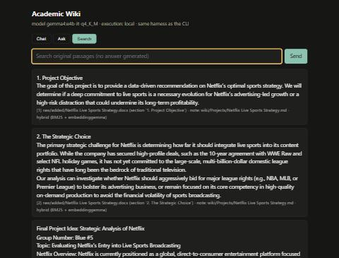

# Optional extras: local web page and online mode

Tested 2026-09-30, `gemma4:e4b-it-q4_K_M`, Ollama 0.35.0.

## Local web page (`wiki serve`): works

`wiki serve --port 8765` starts a standard-library HTTP server bound to 127.0.0.1. Its three endpoints call the same
`Harness` methods as the CLI, so citation checks and saved runs are identical.

| Request | Result |
|---|---|
| `GET /` | 200; the page loads with Chat / Ask / Search tabs |
| `POST /api/search` "lean operations waste" | 2.9 s. Top 3: `Week 6 - Lean Operations.docx` (two sections) and `Summary and news stories.docx`; method hybrid. |
| `POST /api/ask` "Who was the client for my Cambridge consulting project, and how did we plan to gather primary data?" | 38.4 s; status `answered`. "Your client is Mott MacDonald [4]. You planned to gather primary data using focus groups, and you could also use surveys [3]." It cites `Notes from first few meetings.docx` and `Intro and project definition .docx`, the same answer and citations as the CLI test T3. |
| `POST /api/chat` "what can you help me with?" | 14.7 s; `retrieved: false`; a capabilities reply |
| `POST /api/nope` | 404 |

Browser check: I opened the page, chose the Search tab, typed "Netflix live sports strategy" and pressed Enter. The passages
appeared with raw paths and note names, and there were no console errors.



Not tested: the Ask and Chat tabs by hand in the browser (their endpoints were tested above), and concurrent users.

## Online mode (`--mode online`): ask mode tested, 4 / 4 pass

- **What it is:** `wiki ask … --mode online` and `wiki chat --mode online` send the assembled prompt to hosted
  `gemma-4-26b-a4b-it` on the Gemini API (`generativelanguage.googleapis.com`). This is the 26B A4B model that does not fit
  on this laptop. Retrieval and embeddings stay local.
- **What it sends to Google:** the instructions, the question, and the retrieved passages (up to 4,000 characters of my
  notes) for ask; the conversation for chat. Nothing else.
- **How to select it:** set `GEMINI_API_KEY` (from Google AI Studio), then add `--mode online`. Local is the default. The
  key is read from the environment and is not stored in any file in this repository.

### Result

The four ask tests, run with `python tests/run_tests.py --label online --online`. Evidence is kept apart from the local runs
in [evidence/online](../online/summary.md), and every card is labelled "Execution: online".

| Test | Result | Answer |
|---|---|---|
| T1 | answered, cited [1] | "performance, image, and exposure … 10%, … 30%, … 60%" |
| T2 | answered, cited [4] | "Americans paid an average of $2,700 while the Swiss paid $800" |
| T3 | answered, cited [2, 3, 4] | "Your client was Mott MacDonald [4]. … focus groups [2, 3] and potentially surveys [3], noting that Judge normally uses Qualtrics [3]." All citations supported; the only model to cite the PID. |
| T4 | insufficient evidence | refused correctly |

Wall time was 8–80 s per answer, including retries.

### Two problems found while getting it to work

1. **Empty answers.**
   - The hosted model thinks before answering, and its thinking tokens count against `maxOutputTokens`.
   - The harness's 400-token cap for ask left no room for the answer, so the first online attempt returned nothing.
   - The citation check then correctly refused to show it as a grounded answer.
   - Fix in `wiki/llm.py`: online calls use a fixed 4,096-token limit, and thinking parts are dropped.
2. **Sporadic HTTP 500 errors.**
   - Identical requests alternated between 200 and 500 ("Internal error encountered").
   - The cause is unknown; it may be free-tier rate limiting.
   - Fix: up to 5 attempts with increasing waits. If all fail, the command stops with the API error. It never falls back to
     the local model.

### Online chat: tested, works

Script: [scripts/test_online_chat.ps1](../../scripts/test_online_chat.ps1). Output: [online-chat.log](online-chat.log).

| Turn | Result |
|---|---|
| "what can you help me with?" | capabilities reply, no notes search (13.1 s) |
| "Draft a three-line study plan for Operations Management." | a three-line plan, labelled "Suggestion:", no notes search (19.1 s) |
| "make that shorter" | the same three lines shortened, from conversation context (6.6 s) |
| `/notes lean operations waste` | 4 passages retrieved locally; the reply cites [1], [3] and [4] (19.5 s) |

I checked the `/notes` reply against the passages:
- the "ideal process" definition is in [1]
- the "95% of throughput time" figure is in [4]
- Jidoka and the list of wastes are in [3].

All three citations are supported.

**Limit:** hosted Gemma is not given the `search_notes` tool, so online chat never decides to search by itself. It retrieves
only when I type `/notes`. Local chat does get the tool.

### Not tested

- Online mode while offline. It would fail with "could not reach the Gemini API".

### With no key

```
> wiki ask "Who was the client for my Cambridge consulting project?" --mode online
error: Online mode needs GEMINI_API_KEY (create one in Google AI Studio). Local mode needs nothing; drop --mode online.
exit code: 1
```

It stops with an error and does not fall back to the local model or to any other service. Local mode is unaffected.
